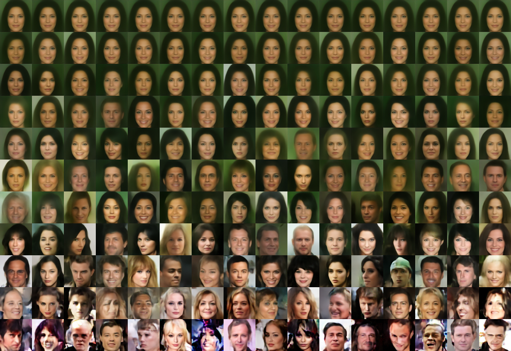

# Nouveau Variational Autoencoder (NVAE)
Simple [NVAE](https://arxiv.org/abs/2007.03898) implementation to be used as 
template for training on other datasets. Intended for effective reuse and 
learning purposes. Will be improved on continually.

Images generated with prior standard deviation (aka temperature) from 0.1
to 1.1 (top to bottom) after first updating batch norms with samples
generated with prior standard deviation 1.0.


## Installation
```
virtualenv venv --python python3.8
source venv/bin/activate
pip install -r requirements.txt
```

## Prepare
Downloads and prepares dataset in a folder like in a normal setting.
```
guild run prepare
```

_You may get an error saying "bad zip file". This means that the limit on
downloading the celeba dataset has been reached._

## Training
```
guild run train
guild run retrain model=<model-hash>
guild run generate model=<model-hash>
```

These are some of the most relevant guild commands:
```
guild tensorboard 1
guild runs
```

See the [guild docs](https://my.guild.ai/docs) for more information.
